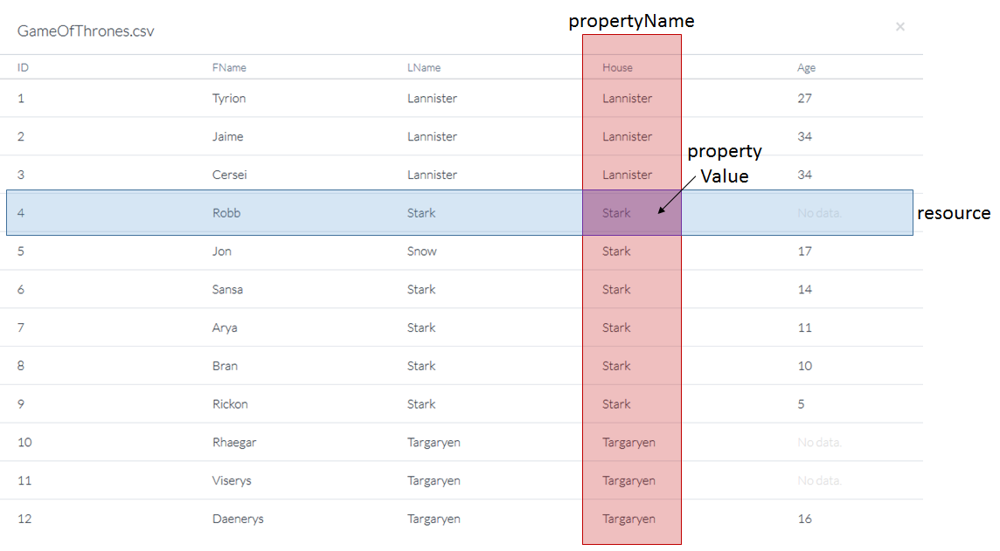
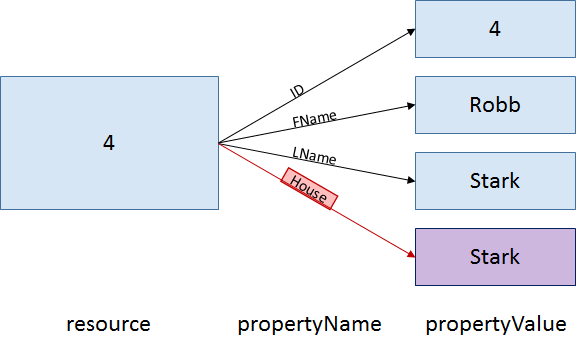
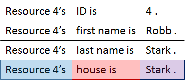
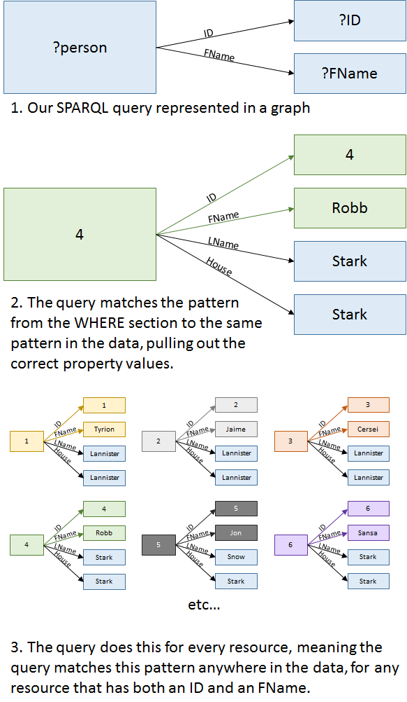

# Your First SPARQL Query

As we mentioned in the [Primer Intro](./intro_tutorial.md), we have designed this primer tutorial to get you up & running and putting SPARQL to work for you as quickly as possible, but there are some fundamental concepts to understand in order to jump into your first query.

## The data you'll query

You will use the “GOT.csv” file in the [data.world tutorial account](https://data.world/tutorial/sparqltutorial) for this tutorial. You can view the file [here](https://data.world/tutorial/sparqltutorial/file/GOT.csv), but note you do not need to download or transfer it to your account on data.world to complete the exercises. Part of the beauty of linked data is that it is usable anywhere at any time by anyone who can access it.

Open up the [the GOT.csv dataset](https://data.world/tutorial/sparqltutorial/file/GOT.csv).  This is a small dataset that details bio information about twelve important people from George R. R. Martin's _Game of Thrones - A Song of Ice and Fire_ series. Each person has a variety of attributes like first name, last name, house, age, and unique ID value. If you are familiar with Excel or SQL, this should look familiar to you. But we won't use SQL to query this data; we will use SPARQL, the language designed to query "Linked Data". What exactly is linked data?

## Tabular vs. Linked Data

Before uploading our _Game of Thrones_ dataset to data.world, it was just ordinary tabular data stored in CSV. Most of the data in the world is stored in tabular data formats like CSVs, Excel workbooks, and relational databases. The tabular data model excels at efficiently storing lists of items and their related properties in distinct files, but it is limited in its ability to link to other data in order to glean complex insights from a multitude of datasets at once. The linked data model is designed to do just that, and that is why all data stored on data.world is automatically converted to linked data for you. This conversion process gives your data all sorts of new functionality, like linking easily to other datasets on data.world. Later on you'll see how that works in the [Linking Datasets Together](./Linking_Datasets_Together.md) tutorial, but for now, let's dig into this data!

## Your first query

### KEYWORDS and concepts you'll learn in the first tutorial

* PREFIX - designates a shorthand to denote your data's namespace
* SELECT - appoints variables for the data your query will retrieve and display to the screen
* WHERE - specifies the data to pull out of your dataset
* Variable - stores data values for future use, either for SELECTion or within the WHERE section
* The basics of the linked data model, and how tabular data translates into linked data

The PREFIX definition may seem particularly opaque at this time if you are unfamiliar with namespaces. For now, you can think of the PREFIX as a guide for the SPARQL processor to find your data, or if you're a programmer, as an `include` or an `import`.

The other definitions may seem confusing as well, so we will explain each of these keywords and concepts in detail below, but let's start by taking a look at your first query and how to run it.

### Running the query

Here is your first SPARQL query. We've prepared this one to show you the nuts and bolts of a SPARQL query. This simple query displays every person's **ID** and **FName** values in a table.

Try running the query by pressing the Run button.


~~~~
PREFIX GOT: <https://tutorial.linked.data.world/d/sparqltutorial/>

SELECT ?ID ?FName

WHERE {
    ?person GOT:col-got-id ?ID .
    ?person GOT:col-got-fname ?FName .
}

~~~~


Before digging into the query's steps, we should explain something important about how linked data is stored.

### A Deeper Dive Into The Data

Uploading a tabular dataset into data.world translates its information into a set of statements for linked data format. Each statement has three parts:

1. a resource,
2. a property name, and
3. a property value.

You can think of each row of a data table as a resource, the column headers as property names, and the data cells as property values. For example, one statement contained in our _Game of Thrones_ data is, "The _resource_ in line 4 has a _property name_ of 'House' and corresponding _property value_ of 'Stark.'" The following three diagrams illustrate this statement in Tabular view, a Linked Data graph, and plain English. These three diagrams all say the same thing.



In a tabular view, the blue resource in line 4 and the red property name overlap at the purple property value.



In a linked data \(or "graph"\) view, the red property name links the blue resource to the corresponding purple property value.



In English, the data is represented as a three-part statement with a blue Subject, a red Predicate, and a purple Object. In fact, you will often see linked data described as "Subject, Predicate, Object triples."

---

> ### In-depth
>
> Take an in-depth look at what Robb Stark's data could look like when stored in a linked data file. Note: although it may look similar, this is NOT a SPARQL query; it is a mock data file in a linked data syntax called `Turtle` (aka `.ttl`).
>
> Just like in English, the data statements end in periods. Data values are denoted with quotes "" and addresses \(or "Resource Identifiers"\) are denoted with open and closed angle-brackets &lt;&gt;. The prefix "GOT:" is necessary to tell the SPARQL processor where to look to find the data.
[comment]: <> (You can learn more about prefixes, what those resource identifiers are, and what they do in a later tutorial [Prefixes, URIs, IRIs, URLs, and Namespaces](insert). To learn more about Turtle and other linked data formats, check out the [RDF Data Model and Syntaxes](insert) tutorial.)

```
# Robb Stark's info
# BTW, you can make comments in RDF/SPARQL with the '#' symbol

@prefix GOT: <https://tutorial.linked.data.world/d/sparqltutorial/>

GOT:row-got-3 GOT:col-got-id "4" .
GOT:row-got-3 GOT:col-got-fname "Robb" .
GOT:row-got-3 GOT:col-got-lname "Stark" .
GOT:row-got-3 GOT:col-got-house "Stark" .

# Note: The resource URI ends in '3' because of 0 indexing, i.e. the first resource is the "0th" resource.
```

---

Now that you know how data is stored, let's break down our SPARQL query line-by-line.

### First line - PREFIX:

```
PREFIX GOT: <https://tutorial.linked.data.world/d/sparqltutorial/>
```

This line sets a shorthand prefix GOT: to refer to `https://tutorial.linked.data.world/d/sparqltutorial/` \(if you have some programming experience, you can think of this as declaring a variable to refer to a string\). While this may look like a URL, it is actually something called a URI, a **U**niform **R**esource **I**dentifier \(URLs are a type of URI\). Unlike URLs, which refer to web pages, URIs refer to resources or information about those resources. The purpose of a URI is to give a unique name to a piece of data.

Aside from functional purposes, prefixes also serve stylistic purposes. Without setting prefixes, the resources' property identifiers quickly become very long and difficult to manage. While it is important to note that setting Prefixes is not strictly necessary, they do make SPARQL queries easier to read and life a lot easier. Otherwise, something as simple as this

```
GOT:row-got-4 GOT:col-got-fname "Robb" .
```

becomes

```
<https://tutorial.linked.data.world/d/sparqltutorial/row-got-3> <https://tutorial.linked.data.world/d/sparqltutorial/col-got-fname> "Robb" .
```

Yuck!

---

### In-depth

To see what your first query looks like without setting a PREFIX:


~~~~
SELECT ?ID ?FName

WHERE
{
    ?person <https://tutorial.linked.data.world/d/sparqltutorial/col-got-id> ?ID .
    ?person <https://tutorial.linked.data.world/d/sparqltutorial/col-got-fname> ?FName .
}
~~~~


This is 100% technically accurate syntax (try running it!), but without the PREFIX declaration it is much less readable and user friendly.

---

### Next line - SELECT:

```
SELECT ?ID ?FName
```

If you have some experience with SQL, this line should look familiar to you. This simply tells the SPARQL processor which data to display, in this case the ID and First Name property values.

Why the question marks?

In SPARQL, question marks denote variables, which behave much the same way as [variables do in computer programming languages](https://en.wikipedia.org/wiki/Variable_%28computer_science%29). They hold values for future use. So `SELECT ?ID ?FName` essentially says, "We're going to find some values to store in `?ID` and `?FName`, and then we're going to display those values."

> ### Note
>
> When you see a '?' think variable. Variables typically start with question marks in SPARQL, but they can also be denoted with a dollar sign '$', which is rare. The common convention is to use question marks.

### Finally - the WHERE section:

```
WHERE
{
    ?person GOT:col-got-id ?ID .
    ?person GOT:col-got-fname ?FName .
}
```

The WHERE section tells the processor which property values to fill into the variables you are SELECTing and how to pull the data out. The SPARQL processor matches patterns you declare within the WHERE section against the three-part statements of fact stored in the data. If you saw the in-depth section above, you probably noticed the query statements look a lot like the statements in Robb's mock data file. The statements within the WHERE section of SPARQL queries follow the same structure:

```
{ resource propertyName propertyValue . }
```

In our query we use two statements to fill in the ?ID and ?FName variables. Both statements in the query begin with ?person, another variable, but ?person is not SELECTed, so it will not project as output to your screen; it is only used within the WHERE section to connect up the data. In SPARQL, variables tell the SPARQL processor that statements with _any_ value in that piece of the statement are a match for the query, and that data gets stored in the variable for use elsewhere in the query.

In other words, the SPARQL processor seeks out statements in the data that match the pattern defined in the WHERE section and binds the data in those statements to the variables. So, our WHERE section's first line says, "Find me people who have IDs," and the second line says, "Then for each of those people, find me their FNames if they have one." There is an implicit AND between each statement in the WHERE section, i.e. only patterns that match **all** statements will be returned by this query. The order of these statements does not matter; reordering the statements still draws the same pattern for the query processor to match against the data. The image below depicts the pattern-matching process, and the in-depth section gives a deep dive into it.

> ### Note
>
> Resources and property names must belong to specific namespaces so that the SPARQL processor knows where to find the correct data, especially when joining with other datasets. The URIs in some of the data's three-part statements may not be chosen by your query's SELECT clause, but they are necessary to identify which data to retrieve and how to cross-reference different bits of data with each other to connect them up.



> ### In-depth
>
> Curious about how the WHERE section works? Here is a step-by-step guide:
>
> 1. The first statement "?person GOT:col-got-id ?ID ." tells the SPARQL processor to look in the data and find a resource that has an ID property and store that value in ?ID. In this case it will likely find the resource referring to Tyrion, because he is listed first in the data, but that is not always the case; the SPARQL processor may find the data in any order. For now, let's say ?ID gets value "1".
>
> 2. The SPARQL processor then binds that resource \(Tyrion's row - GOT:row-got-0\) to ?person for the remainder of the query's statements.
>
> 3. The next statement "?person GOT:col-got-fname ?FName ." then tells the SPARQL processor to check whether the resource stored in ?person has a `GOT:col-got-fname` property, and, if so, to store that value in ?FName. The first row does have an FName, so "Tyrion" gets stored in ?FName.
>
> 4. Now that all the query statements have run, the SPARQL processor reiterates them for every resource in the data, storing all ID and FName values in the ?ID and ?FName variables. It does this for all resources that contain data in both properties.

---

> ### BTW
>
> In our case, every resource \(or row of data\) denotes a person from the books, so we named the variable ?person. Like in programming, it's a good idea to name your variables in a way that denotes their purpose.

---

> ### BTW
>
> Do you know what would happen if a resource didn't have either an ID or an FName? Quite simply, the resource would not be displayed at all. In this example, all resources in the data have both an ID and an FName, so the query finds, returns, and displays the appropriate information for _all_ resources. This query's WHERE clause asks for resources that have _both_ an ID and an FName.

---

> ### BTW
>
> SPARQL does not recognize white space, so the WHERE section could have read as one line like so:
>
> ```
> WHERE { ?person GOT:col-got-id ?ID . ?person GOT:col-got-fname ?FName . }
> ```

That's it for your first query!

## In this section you learned

* The basics of linked data and how data uploaded to data.world translates into it
* What variables are and how they are used to store desired values in SPARQL queries
* The three fundamental KEYWORDS \(PREFIX, SELECT, and WHERE\) of any SPARQL query so you can start to write your own queries

## Practice

Every section of this tutorial has an exercise; head over to [this section's exercise](./exercise_YFSQ.md) to put your new skills to the test!
